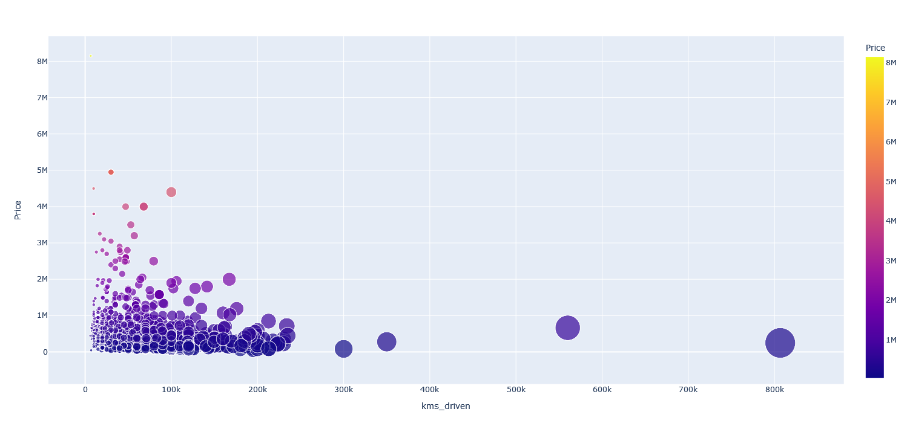
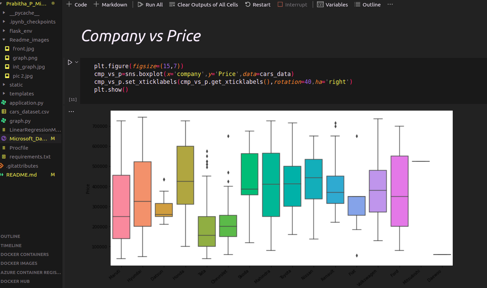

# Predicto
👉 Pause a moment here and have a look at this [click here](https://youtu.be/3Gx3Sm815G8)
* A Greater Way to Predict your Dream Car's Price 🎯

> &ensp;📊  Predict the selling price of the car with ease  
  &ensp;👀 Play around with the interactive graph and visualize the trends   

 
>  &ensp; **Target audience include** 
  &ensp;🚘The one who wants to sell their car 
  &ensp;🏢 The companies that would like to know at what extend their cars could be sold out to   

__As said, Visualization is a great way to learn things! Go ahead and explore to understand the drift. Here you will be able to visualize the relationship between car company, Kilometers driven and the price at which it has been sold previously.__ 

### Soul of Predicto: [Prabitha_P/Data_Analysis.ipynb](./Prabitha_P/Data_Analysis.ipynb) 

### Deep Dive into codes
 * __Brain of the Predicto:__ [Prabitha_P/application.py](./Prabitha_P/application.py)
 * __Graph codes:__ [Prabitha_P/graph.py](./Prabitha_P/graph.py)
